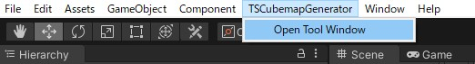

# TSCubemapGenerator
Cubemap generation tool for Unity

## Installation

### Package Manager
- Window -> Package Manager
- Add package from git URL...
- Add the package URL
  - `https://github.com/tsgcpp/TSCubemapGenerator.git?path=Assets/Plugins/TSCubemapGenerator#1.0.0`

#### About Package Manager
https://docs.unity3d.com/Manual/upm-ui.html

## Support Unity Version
- Unity 2019.4 or later

## Usage
- You can watch the flow in this movie
  - https://youtu.be/ARbiXirv1BY

### 1. Open Tool Window
- TSCubemapGenerator -> Open Tool Window

### 2. Setup
- Load a scene to be baked into Cubemap
- Create a `Camera` to render the scene
  - You should add `Skybox` component with a skybox material and to the `Camera`
- Set a material for preview to `Preview Material` in the tool
  - You can also use `PreviewMaterial.mat` in the package
- Click `Start` button

### 3. Rendering
- Move the `Camera` to a rendering point
- Click `Render Cubemap`
  - You can also use `Enable Realtime Rendering` to update the cubemap automatically
  - WARNING: `Enable Realtime Rendering` is **heavy**, so you should use this with low size

### 4. Export
- Click `Export Cubemap to File`

#### Appendix
- If the cubemap folder is under `Assets`, the cubemap will be imported as a Cubemap asset
- If not so, you should set the parameters to the cubemap
  - TextureShape: Cube
  - Mapping: 6 Frames Layout (Cubic Environment)

## FileType
- VerticalPng
  - PNG images with vertical cross layout
- HorizontalPng
  - PNG images with horizontal cross layout

[Cubemaps](https://docs.unity3d.com/Manual/class-Cubemap.html)

## License
- [LICENSE](./LICENSE)
